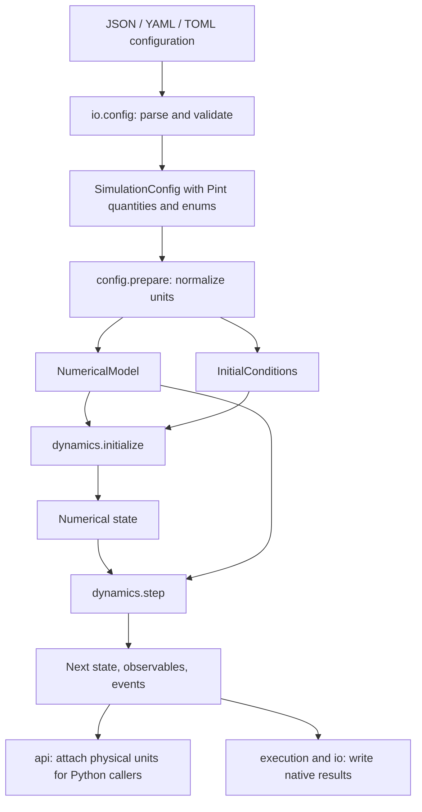

# Understanding the Python implementation

Start here to understand what the code does and where each part lives. The
[scientific guide](scientific-guide.md) gives the equations and their sources;
this guide connects those equations to the Python objects and execution flow.

## The three objects to understand first

The solver separates fixed physical parameters from quantities that evolve.

| Object | Meaning | Examples of its contents |
| --- | --- | --- |
| `NumericalModel` | The physical and numerical rules for a run | Masses, timestep, interaction parameters, pressure, cell inertia, simulation mode, temperature-control settings |
| `SimulationState` | Everything needed to continue from a particular instant | Cell, positions, velocities, current and previous accelerations, reference cell, time, controller counter, running sums |
| `StepResult` | What happened during one integration step | The next state, measured observables, and structured rescaling/quenching events |

`step(model, state)` returns a new result. It does not update the old state in
place. This makes continuation explicit: the caller passes `result.state` to
the next call. `simulate` repeats this operation and yields each result as it
becomes available.

Before a numerical model exists, `SimulationConfig` describes the user's run.
It contains Pint quantities, a `Structure`, enum choices, and application
settings such as the total step count and output interval. `prepare(config)`
converts this into the normalized `NumericalModel` and `InitialConditions`.

`InitialConditions` supplies the initial cell and positions, together with the
choice of thermal or provided velocities. It is an input to initialization,
not a replacement for the complete evolving state.

## Repository map

```text
src/vcsmd/
  __init__.py          convenient public imports
  api.py               public states/results with physical units
  config.py            Structure, SimulationConfig, and normalization
  units.py             Pint registry and quantity conversion
  models.py            enums and normalized numerical data structures
  geometry.py          cell geometry, wrapping, and image coverage
  potentials.py        periodic Lennard–Jones energy, forces, and virial
  cell_dynamics.py     cell accelerations and cell kinetic energy
  dynamics.py          initialization and Beeman integration
  observables.py       energies, pressure, temperatures, and running averages
  io/
    config.py          JSON, YAML, and TOML parsing/serialization
    checkpoint.py      complete numerical state in versioned NPZ archives
    __init__.py        public file adapters, including unit-bearing checkpoints
  execution.py         run folders, CSV streams, checkpoints, and progress
  cli.py               command-line arguments and dispatch
  __main__.py          python -m vcsmd entry point
  compat/
    legacy.py          historical input/output conversion

examples/              the eight original full workloads in native format
scripts/               maintained post-feature validation workflows
docs/                  architecture, science, conversion, and validation guides
runs/                  generated results; excluded from Git
```

The validation scripts are useful reproducibility tools. They are not
alternative solver implementations. The retained final run contains one
shared snapshot of the exact implementation that produced its trajectories.

## From a configuration file to a simulation



1. `load_config` reads the file using its suffix. All three formats become the
   same mapping before schema validation. Serialized choices such as
   `metric-dyn` become `SimulationMode` members here.
2. `Structure` validates cell/particle shapes and per-particle masses. Pint
   quantities are required for dimensional fields. Bare fractional positions
   are dimensionless arrays.
3. `prepare` produces owned, read-only arrays and normalized scalar parameters.
   It checks the formulation-specific dimensions of cell inertia. The result
   contains no paths or parsing instructions.
4. `initialize` establishes velocities, initial accelerations, acceleration
   history, the reference cell, and empty controller accumulators. Its seed is
   explicit. The application passes the configured seed, whose default is 119.
5. `simulate` advances the numerical state lazily. The public API wraps each
   result with physical units; the file-writing application can consume the
   normalized results directly and label output columns with their units.

File formats stop mattering after parsing. A JSON and TOML configuration that
describe the same physical data produce the same numerical model.

## Public quantities and numerical values

The public API is imported from `vcsmd`:

```python
from pathlib import Path

from vcsmd import initialize, prepare, simulate
from vcsmd.io import load_config

config = load_config(Path("examples/input-01.toml"))
model, initial = prepare(config)
state = initialize(model, initial, seed=config.seed)

for result in simulate(model, state, steps=config.steps):
    state = result.state
    temperature = result.observables.atomic_temperature.to("kelvin")
```

This is the first original full 1,000-step workload. The loop itself writes no
files. Use `vcsmd.execution.run(config)` or the CLI for persistent output.

There are two state representations with the same scientific fields:

| Location | Intended use | Dimensional representation |
| --- | --- | --- |
| `vcsmd.SimulationState`, implemented in `api.py` | Ordinary Python callers | Properties such as `cell`, `time`, and velocities are Pint quantities |
| `vcsmd.models.SimulationState` | Numerical kernels and low-level persistence | Float64 arrays and scalars in documented internal units |

The public state wraps its numerical state in the explicit `numerical`
attribute. Most callers do not need to access that attribute. Similarly,
`vcsmd.io.load_checkpoint` returns a public state ready for `vcsmd.simulate`;
the lower-level checkpoint module returns normalized objects for execution.

The internal units are bohr, Rydberg, and `rydberg_time = ℏ/Ry`. The corresponding
mass is `Ry * rydberg_time**2 / bohr**2`, or two electron masses. Normalization
happens before numerical work, rather than inside the force and integration
loops. Unit attachment is separate from the equations.

The arrays are independently owned and marked read-only. This prevents
ordinary accidental assignment through a published state. It is a programming
contract, not a security mechanism against callers deliberately changing NumPy
write flags or accessing implementation details.

## Geometry: what the arrays mean

| Field | Shape | Meaning |
| --- | --- | --- |
| `cell` | `(3, 3)` | Cell vectors as matrix **columns** |
| `fractional_positions` | `(N, 3)` | One particle per row, wrapped into `[0, 1)` |
| `fractional_velocities` | `(N, 3)` | Rates of change of fractional coordinates, with dimensions of inverse time |
| `cell_velocity` | `(3, 3)` | Rates of change of the cell-vector components |
| `masses` | `(N,)` | One positive mass per particle |

With these conventions:

```python
cartesian_positions = fractional_positions @ cell.T
peculiar_velocities = fractional_velocities @ cell.T
cartesian_velocities = (
    peculiar_velocities + fractional_positions @ cell_velocity.T
)
```

Peculiar velocities describe particle motion relative to the deforming cell.
The full Cartesian derivative also contains motion caused by cell deformation.
Atomic kinetic energy and kinetic stress use peculiar velocities. The public
state exposes both velocity interpretations explicitly.

`geometry.py` computes volume, inverse metric, and cofactors from the cell. It
also checks that the selected periodic-image range covers the cutoff. It does
not identify crystal symmetry or replace the cell by a standardized cell.

## What one step actually does

The public `step` delegates to `dynamics.step`, whose implementation is easiest
to read through `_advance` in this order:

1. **Predict positions and cell.** The Beeman predictor uses the current rates,
   current accelerations, and previous accelerations. Particle coordinates are
   wrapped periodically; the cell matrix evolves only in variable-cell modes.
2. **Evaluate interactions.** `potentials.evaluate_lennard_jones` returns the
   potential energy, Cartesian forces on the particles, and virial tensor.
   Central distinct pairs are counted once; noncentral ordered pairs include
   self images and use the appropriate energy/virial counting factor.
3. **Calculate accelerations.** Particle forces are transformed into fractional
   acceleration. Variable-cell modes add the coupling to the changing cell
   metric. `cell_dynamics.cell_acceleration` applies the selected cell equation
   and the source's common strain projection.
4. **Correct velocities.** Beeman's corrector uses the newly evaluated
   accelerations. The implementation keeps the acceleration evaluated at the
   predicted velocity, following the source's single predictor/corrector pass.
5. **Measure the completed step.** `observables.measure` calculates energies,
   internal pressure, volume, temperatures, and updated running sums.
6. **Apply controller actions.** When configured, temperature rescaling acts
   at its interval. Minimization quenches velocity components whose acceleration
   changed sign. Rescaling also resets the relevant running averages and
   decrements the remaining rescaling counter.
7. **Return new state and events.** Previous/current acceleration history is
   advanced explicitly. The old state and model remain unchanged.

The order of steps 5 and 6 matters. `result.observables` describes the state
**before** rescaling or quenching, while `result.state` is **after** those
actions. Native checkpoints and trajectories use the returned state. An event
records the action so that the application can explain the difference.

`potentials.py` bounds its temporary image/pair batches instead of allocating an
array for every particle pair in every image. It evaluates an inclusive,
unshifted cutoff. All particles share one Lennard–Jones parameter set; species
labels do not imply separate pair potentials or mixing rules.

## How the eight modes share code

There are four cell formulations and two evolution behaviors:

| Formulation | Cell behavior | Cell-inertia dimensions |
| --- | --- | --- |
| Fixed cell | Only particle coordinates evolve | Not used |
| Ordinary cell dynamics | Evolve cell vectors with the Parrinello–Rahman equation | Mass |
| Modified metric | Evolve cell vectors with the cofactor-dependent kinetic metric | Mass / length⁴ |
| Reference strain | Evolve cell vectors using the fixed reference-cell metric | Mass / length⁴ |

For each formulation, dynamics retains the calculated velocities and
minimization adds component-wise velocity quenching. Both use the shared
Beeman implementation. Temperature control is a separate explicit setting.

The enum's properties select these mathematical choices. There are no eight
copies of the integration loop. `cell_dynamics.py` contains the formulation
differences and uses the matching cell kinetic energy in each case. Its strain
projection applies to every variable-cell formulation, as in the source.

## State history and exact continuation

A cell and list of positions are insufficient to resume this integrator.
Continuation also requires both acceleration histories, particle and cell
rates, the reference cell, the current step/time, controller counters, and
running energy/pressure accumulators.

These values are fields of `SimulationState`, not hidden module variables.
Native checkpoints save them together with all model parameters in a versioned
NPZ archive without Python pickle objects. Loading validates the archive and
its state/model consistency. `resume` loads this state and advances it for the
requested number of **additional** steps, writing a new run folder.

Exact continuation was demonstrated within the validated numerical environment.
Changing code, numerical libraries, or hardware can change floating-point
rounding. Historical restart files are converted as partial data when required
history is unavailable or damaged.

## Application boundaries

`execution.py` owns run-folder creation, provenance, CSV streams, progress
callbacks, and checkpoints. The numerical modules never call it. CLI arguments
are interpreted only in `cli.py`. JSON/YAML/TOML parsing and filesystem access
belong to the adapters under `io`.

The legacy adapter parses old records and can call native configuration
validation. Dependencies point from that adapter toward the native schema;
the solver never imports the adapter. Imported datasets preserve available
historical values and are distinct from complete native trajectories. See the
[conversion guide](legacy-conversion.md) for the historical format details.

## Reading order and extension points

Read `api.py` and `config.py` first for the calling interface, then `models.py`
for explicit state. Continue with `dynamics.py` for the sequence above, followed
by `potentials.py` and `cell_dynamics.py` alongside the scientific guide.
`execution.py` and the file adapters are useful when working on output or
configuration rather than equations.

For a future change, keep its responsibility in the corresponding layer:

- A new cell formulation affects the mode enum, inertia normalization, cell
  acceleration, and matching cell kinetic energy.
- A new observable affects the numerical and public observable models,
  reduction, unit attachment, and CSV unit labels together.
- A new file format belongs in an adapter and should produce the existing
  validated schema.
- A legacy parsing fix stays in `compat` and must preserve source provenance.

## Coding conventions and remaining limitations

Functions, variables, and fields use `snake_case`; classes use `CapWords`;
constants and enum members use uppercase names. Domain names such as
`fractional_positions` and `cell_inertia` are used at interfaces. Short symbols
such as `dt` remain local to mathematical expressions.

The design uses enums, type annotations, dataclasses, pathlib adapters, local
random generators, read-only numerical arrays, and iterator-based execution.
Ruff checks and formatting cover mechanical style. Public entry points now
include source-level docstrings accessible through Python's `help()`.

This is still an initial implementation. The execution and conversion
orchestrators are larger than ideal, observable units are selected using field
names rather than an explicit central schema, and static type checking has not
been run. These are concrete maintainability limits; passing Ruff does not
establish complete type safety, API quality, or scientific validity. Scientific
coverage and its limits are recorded separately in the
[validation report](validation.md).
